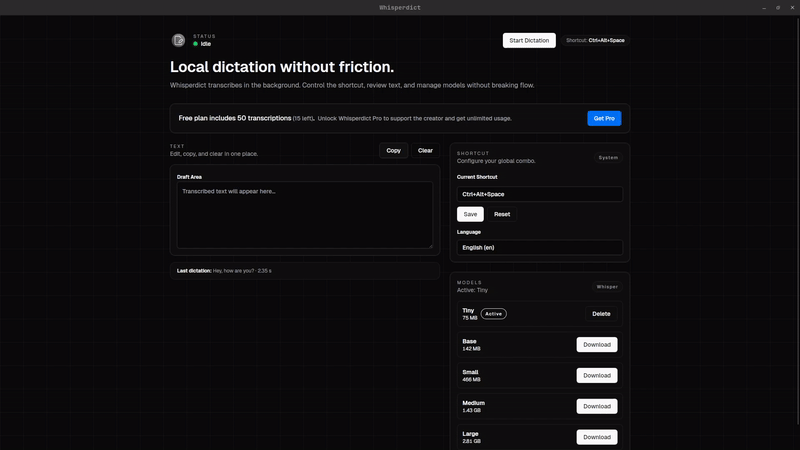

# Whisperdict

  <strong>Private, offline voice dictation for Linux.</strong> 
  Press a shortcut. Speak. Get text where your cursor is. 
  No cloud. No tracking. No nonsense.

  
  
  
  

## Why Whisperdict?

Most dictation tools:

- Send your voice to the cloud.
- Require subscriptions.
- Barely support Linux.
- Lock you into proprietary ecosystems.

**Whisperdict does the opposite.**

- 🐧 Built for Linux users.
- 🔒 100% offline processing.
- 🧠 Runs local Whisper models on your machine.
- 🚫 No audio ever leaves your device.
- ⚡ Instant global shortcut workflow.

If you care about privacy and want a good tool, this is for you.

## What it does

1. Press your global shortcut (`Ctrl+Alt+Space` by default).
2. Speak naturally.
3. Text appears where your cursor is.

No browser tabs.  
No context switching.  
No cloud latency.

## Privacy by design

Whisperdict uses local Whisper models via `whisper-rs`.

That means:

- Audio is processed entirely on your machine.
- No API calls.
- No telemetry.
- No external servers.
- Works fully offline.

Airplane mode compatible.

## Features

- Global system-wide shortcut
- Multiple local Whisper models (`tiny` → `large`)
- In-app model download & management
- Language selection
- Automatic clipboard + paste injection
- Lightweight desktop UI
- Usage counter
- Open source

## Installation

### Download

Grab the latest release:

👉 https://github.com/nabby27/whisperdict/releases

## Defaults

- Shortcut: `Ctrl+Alt+Space`
- Model: `base`
- Language: `en`
- Free usage counter: `50` transcriptions

## Built With

- Tauri 2
- Rust (audio capture, hotkeys, whisper-rs, paste automation)
- React + TypeScript (Vite)

## Who is this for?

- Developers on Linux
- Privacy-conscious users
- Writers who prefer speaking over typing
- People tired of cloud dictation tools

If you want Mac-style dictation on Linux — without giving your voice to Big Tech — this is it.

## Contributing

Issues and PRs are welcome. If you find a bug or want a feature, open an issue with:

- OS/Linux distro
- Desktop environment
- Steps to reproduce
- Expected vs actual behavior

## License

This project is licensed under the MIT License. See `LICENSE`.
